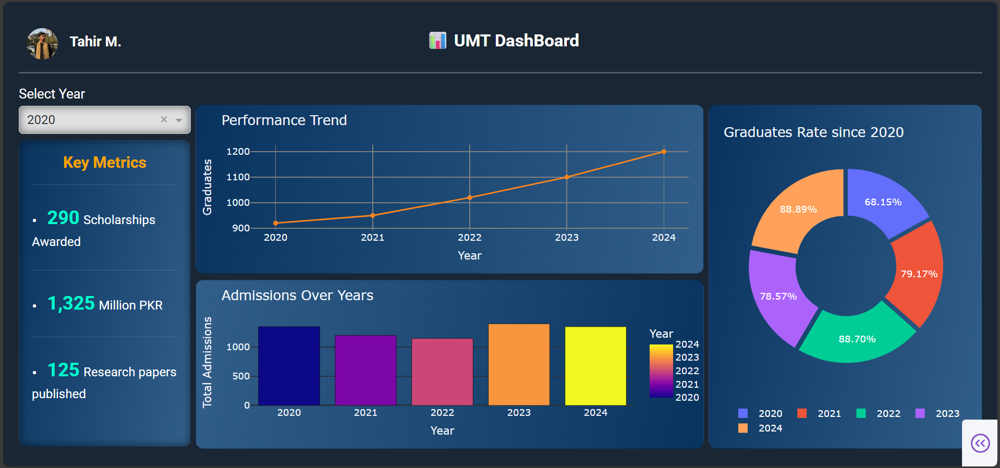

# UMT Yearly Insights

This is a UMT yearly dashboard built with Python and Plotly Dash.  
It displays yearly statistics of the University of Management and Technology (UMT) from 2020 to 2024, including admissions, scholarships, graduates and performance insights.

## Features
- Interactive line, bar and pie chart
- A dropdown button that changes the key insights
- Year-wise data comparison
- Clean navy-blue themed interface
- Responsive card layout using Dash Bootstrap

## Technologies Used
- Python
- Plotly Dash
- Pandas
- Dash Bootstrap Components

## 🖼️ Dashboard Preview

*(Fig: A preview of the UMT Dashboard interface)*

- ## Author
**Tahir Mehmood**  
BS Data Science | UMT Lahore  
GitHub: [Tahir0806](https://github.com/Tahir0806)

